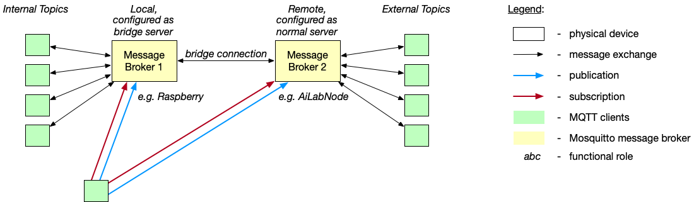

# Dealing with the mosquitto message broker

## Manage user accounts

### Create users

#### Method 1 - manually dealing with simple text file

1. Create text file `~/repositories/AI-CPS/code/messageBroker/users.txt`.
It shall have the following format:

```
   user1:password1
   user2:password2
```

2. Encrypt passwords of this text file:

```
   mosquitto_passwd -U ~/repositories/AI-CPS/code/messageBroker/users.txt
```

3. The password file is now ready to use.
So, for instance start message broker.

#### Method 2 - automated dealing with simple text file

1. Add new user `~/repositories/AI-CPS/code/messageBroker/users.txt` with password `newUserPassword` by

```
   mosquitto_passwd -b ~/repositories/AI-CPS/code/messageBroker/users.txt newUser newUserPassword
```

1. Delete user `~/repositories/AI-CPS/code/messageBroker/users.txt` from password file:

```
   mosquitto_passwd -D ~/repositories/AI-CPS/code/messageBroker/users.txt userToBeDeleted 
```

## Start message broker server with custom config file

By using the `mosquitto.conf` file, an independent message broker is started:

```
   /usr/local/sbin/mosquitto -c ~/repositories/AI-CPS/code/messageBroker/mosquitto.conf
```
By using the `mosquittoBridge.conf` file, a message broker is started
that acts as bridge among different message brokers.
It therefore routes messages among brokers:

```
   /usr/local/sbin/mosquitto -c ~/repositories/AI-CPS/code/messageBroker/mosquittoBridge.conf
```

In this example, by having a look on the corresponding `.conf` file,
the following becomes clear:
All messages (indicated `in` and `out`) and all topics (indicated by `#`) 
are routed among the local bridge server and the server (ip `141.89.39.174:1883`) without filtering
at Quality of Service (QoS) level `0`.
Here, the connection is called `bridge-to-ailabnode02`.

```
   connection bridge-to-ailabnode02
   address 141.89.39.174:1883
   topic # out 0
   topic # in 0
```

So, without noticing complex bridge hierarchies,
the client subscribes once at `broker1` and publishes once at the same broker, 
effectively the client subscribes to topics on `broker1` and publishes them to `broker2`
as well as the client subscribes to topics on `broker2` and publishes them ot `broker1`.



## Establish connection with user account

### Manually via CLI

For instance, publish a message from CLI with account `user1` having password `password1`,
which has been encrypted and loaded by message broker at `localhost` at port `1883`:

```
   mosquitto_pub -t "CoNM/workflow_system" -u user1 -P password1 -m "Please realize the following AI case: scenario=apply_knnSolution, knowledge_base=marcusgrum/knowledgebase_apple_banana_orange_pump_20, activation_base=marcusgrum/activationbase_apple_okay_01, code_base=marcusgrum/codebase_ai_core_for_image_classification, learning_base=-, sender=SenderA, receiver=ReceiverB." -h "localhost" -p 1883
```

Details can be found at the manual page [mosquitto_pub manual page](https://mosquitto.org/man/mosquitto_pub-1.html).

### Code-based via Python

For instance, publish a message from Python script with account `user1` having password `password1`,
which has been encrypted and loaded by message broker at `localhost` at port `1883`:

```
   # establish connection of client and server
   client.username_pw_set(username="user1", password="password1")
   client.connect(MQTT_Broker, 1883, 60)
```

Please note, the `username_pw_set()` needs to be called before `connect()`.