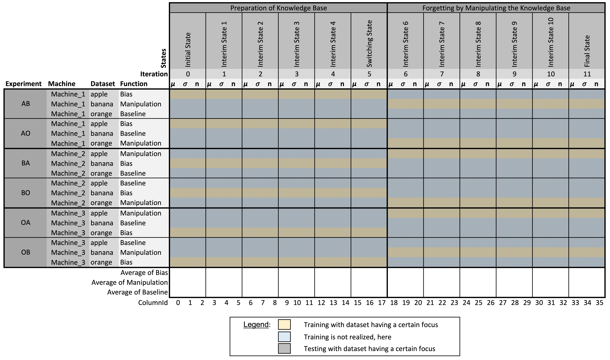

# Dealing with the python message client

This script initiates the communication client and manages the corresponding AI reguests.

The tool was originally developed by Dr.-Ing. Marcus Grum.

## Getting-Started

1. Start the `message broker`. Further details can be found at the corresponding `Readme.md`.

1. Start the `messaging client` by

    ```
    python3 AI_simulation_basis_communication_client.py
    ```

1. Initiate a request, which for instance can come from an Industry 4.0 production system, a modeling software or manually.

## AI Requests

### 1. wire_annSolution

### 2. create_annSolution

### 3. refine_annSolution

### 4. apply_annSolution

### 5. evaluate_annSolution

### 6. realize_annExperiment

#### Proceeding


#### KPIs

KPIs collected by the experiment can be found as follows:

