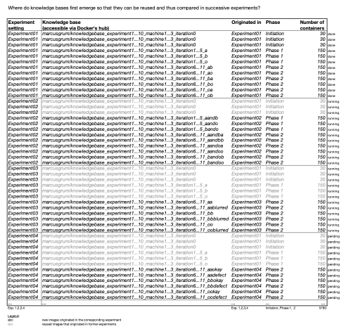

# Experiments

The here shown experiments demonstrate the use of the AI-CPS toolset.
In principle, AI requests are triggered via MQTT network structures and the communication client manages the corresponding AI reguests.

Further, each experiment focuses on the one or other research aspect.
Further details can be found at each experiment-specific sub-folder.

The tool and experiments were originally developed by Dr.-Ing. Marcus Grum.

## Knowledge bases created for experiments

At each experiment, new knowledge bases are created.
Since knowledge bases shall be comparable over all experiment runs, subsequent experiments reuse knowledge bases that already have been set up in former experiments.
The following presents an overview of all knowledge bases, their initial creation, and their reuse.

