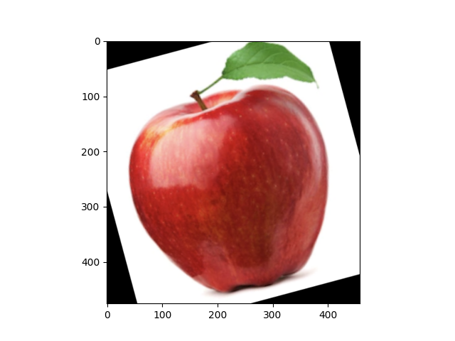
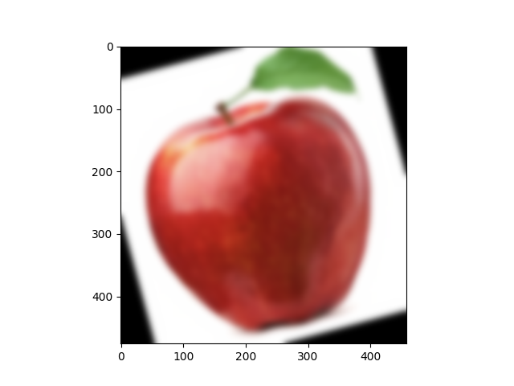
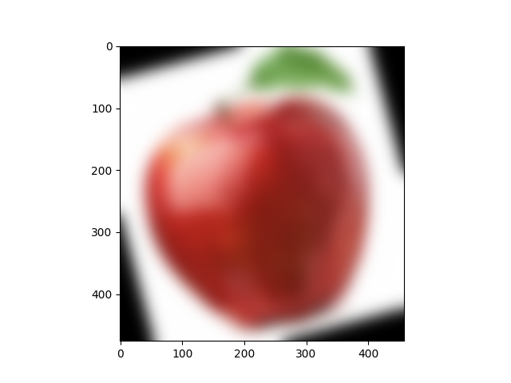
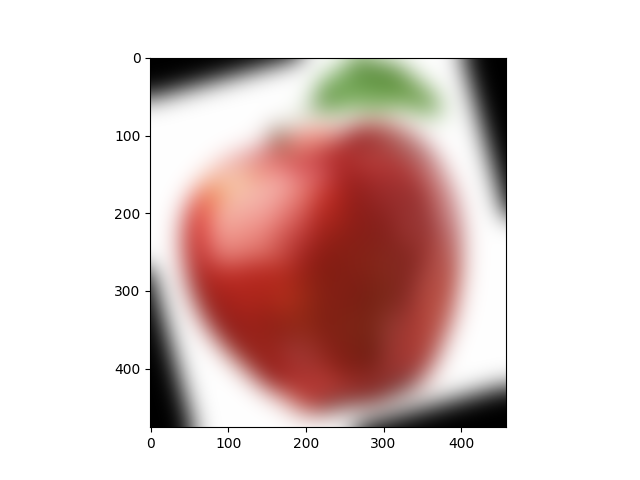
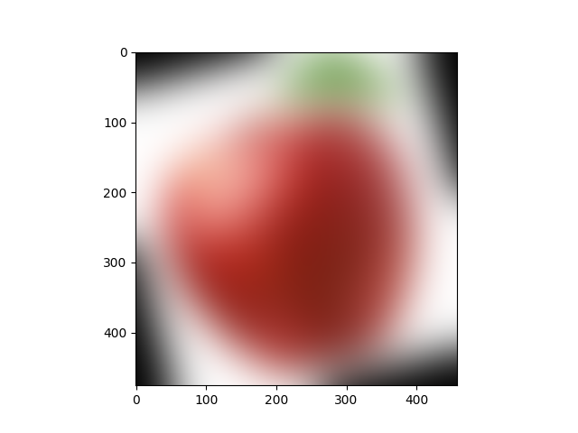
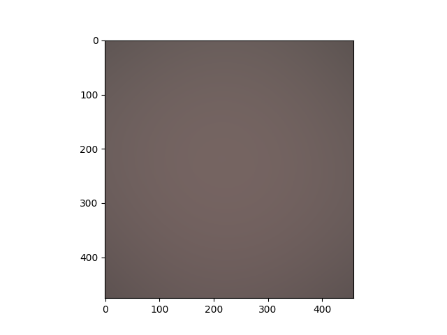
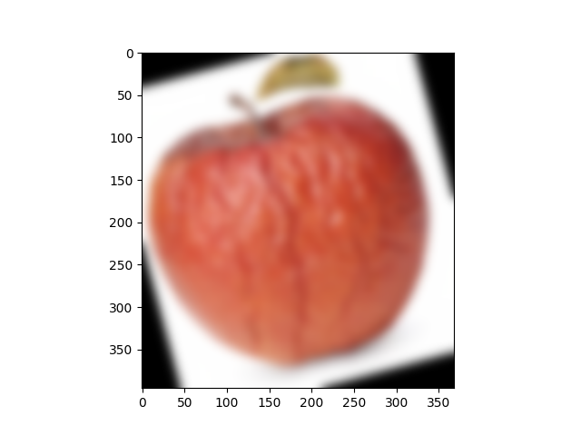
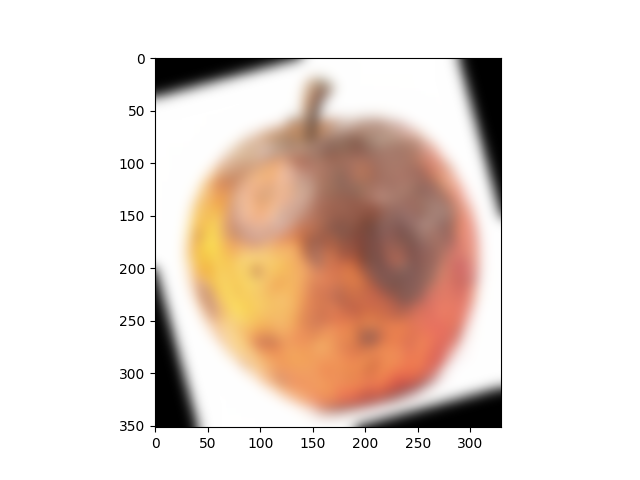

# Blurring Test

When blurring an image, we make the colour transition from one side of an edge in the image to another smooth rather than sudden. 
The effect is to average out rapid changes in pixel intensity.
`Blurring` is to make something less clear or distinct. 
This could be interpreted quite broadly in the context of image analysis 
- anything that reduces or distorts the detail of an image might apply.

A `Gaussian blur` is a filter that makes use of a `Gaussian kernel`.
A kernel, in this context, is a small matrix which is combined with the image using a mathematical technique: convolution. 
Different sizes, shapes and contents of kernel produce different effects. 
The kernel can be thought of as a little image in itself, and will favour features of a similar size 
and shape in the main image. On convolution with an image, a big, blobby kernel will retain big, blobby, low spatial frequency features.

An example explanation on this can be found at [The Carpentries and Data Carpentry](https://datacarpentry.org/image-processing/06-blurring/).

Based on the pictures 
`rotated_by_15_Screen Shot 2018-06-08 at 4.59.36 PM.png`,
`rotated_by_15_Screen Shot 2018-06-07 at 2.15.20 PM.png` and 
`rotated_by_15_Screen Shot 2018-06-07 at 2.15.34 PM.png`,
different blurring levels have been tested for experimentation.

Some impressions can be seen in the following.
For instance, the variations of Sigma effect a non-blurred (initial) picture as the following table shows.

<table>
  <tr>
     <td>Sigma used for Gaussian blurring</td>
     <td>Picture</td>
  </tr>
  <tr>
    <td>No blurring (initial picture)</td>
    <td></td>
  </tr>
  <tr>
    <td>0.03</td>
    <td></td>
  </tr>
  <tr>
    <td>0.3</td>
    <td></td>
  </tr>
  <tr>
    <td>3</td>
    <td></td>
  </tr>
  <tr>
    <td>4</td>
    <td></td>
  </tr>
  <tr>
    <td>5</td>
    <td></td>
  </tr>
  <tr>
    <td>6</td>
    <td></td>
  </tr>
  <tr>
    <td>9</td>
    <td></td>
  </tr>
  <tr>
    <td>12</td>
    <td></td>
  </tr>
  <tr>
    <td>15</td>
    <td></td>
  </tr>
  <tr>
    <td>30</td>
    <td></td>
  </tr>
  <tr>
    <td>300</td>
    <td></td>
  </tr>
 </table>

The expert panel decided for `sigma=6`resulting in pictures 
that hardly can be used to distinguish fresh and rotten apples.
At least, that's the human perspective.
Let's see inhowfar ANNs are challenged by this.

In order to get some impressions, the following shows some picture examples for blurred (challenged) classification.

<table>
  <tr>
     <td>Original picture</td>
     <td>Blurred picture</td>
     <td>Correct classification</td>
  </tr>
  <tr>
     <td></td>
     <td></td>
     <td>okay</td>
  </tr>
  <tr>
     <td></td>
     <td></td>
     <td>defect</td>
  </tr>
  <tr>
     <td></td>
     <td></td>
     <td>defect</td>
  </tr>
</table>

Let's see inhowfar this kind of blurring and removed details challenge the ANN trained...

Please remark: Larger sigma values may remove more noise, which is beneficial.
But larger sigma values will also remove detail from an image, which is a challenge.