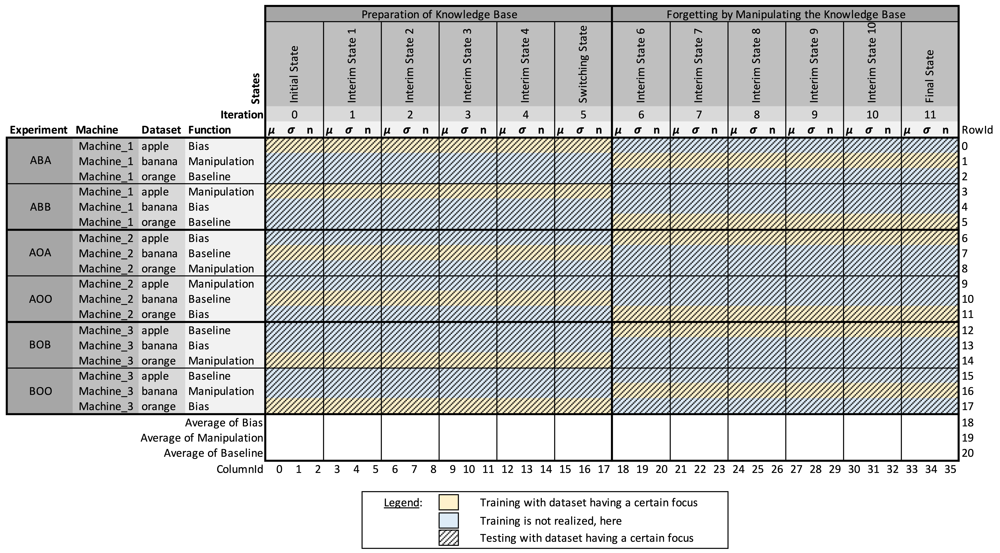
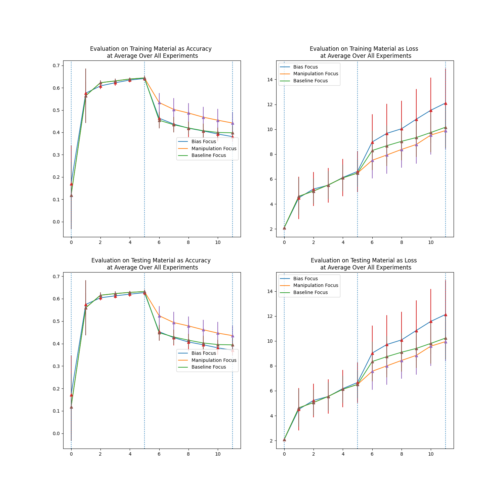

# Experiment 02

The `experiment02` simulates the manipulation of CPS knowledge base by smart sensors overtaking tasks partly - filtering sensory input (in context of continual learning and training data manipulation): 
Inhowfar do AI-based CPS forget if fruit evaluation is overtakten by preceeding smart sensors and the CPS's current specialization does not correspond to the required set of skills?

## Getting-Started

### ...via message client remotely

1. Start the `message broker`. Further details can be found at the corresponding `Readme.md`.

1. Start the `messaging client` by

    ```
    python3 ../../messageClient/AI_simulation_basis_communication_client.py
    ```

1. Initiate `realize_annExperiment` request, which for instance can come from an Industry 4.0 production system, a modeling software or manually.

    ```
    mosquitto_pub -t "CoNM/workflow_system" -u user1 -P password1 -m "Please realize the following AI case: scenario=realize_annExperiment, knowledge_base=-, activation_base=-, code_base=-, learning_base=-, sender=SenderA, receiver=ReceiverB." -h "localhost" -p 1883
    ```
    
    Please note: Make sure that the corresponding experiment selection
	in the `realize_scenario()` function in `AI_simulation_basis_communication_client.py` is uncommented.
	Alternatively, an individual scenarios can be provided, here,
	so that each experiment can be triggered remotely if requested.

### ...manually

1. Start the script by

    ```
    python3 experiment02.py
    ```

## Experiment characterization

### Knowledge base use in corresponding experiments

At each experiment, new knowledge bases are created (cf. proceeding).
Since knowledge bases shall be comparable over all experiment runs, subsequent experiments reuse knowledge bases that already have been set up in former experiments.
The following presents an overview of all knowledge bases, their initial creation, and their reuse.


### Proceeding for Experiment02


### KPIs in Experiment02

KPIs collected by the experiment can be found as follows:

For training as well as testing, `accuracies`, `losses`, `number of data` (training or testing data) have been collected as individual kpi files.
These have been reorganized and summarized as `mu`, `sigma` and `n` as the following presents.



These files and KPIs are used for statistical analyses, whose code can be found at the following path:

    ```
    repository/documentation/experiment02/statistics
    ```

### Results of Experiment02

Results of this experiment can be found at the following path:

    ```
    repository/documentation/experiment02/
    ```

Here, one can find KPIs collected as well as plots generated.
For instance, the overview plot shows accuracies and losses of training and testing courses.



Here, one can see that bias and manipulation are learnt successfully and forgotten as well as remained successfully after learning base has changed.
After the change of the learning base, bias focused product type is remained successfully, while mainipulation product type is forgotten successfully.
Since learnt and unlearnt / forgotten knowledge base can be distinguished clearly separable (faced with non-overlapping standard deviations),
one can recognize this mechanism as effective approach to unlearn or intentionally forget in ANNs.
This can be seen at all performance levels, which means all training and testing runs as well as accuracy and loss metrics.

Statistics will proof this on a significant level.

### Attempts for a research answer of Experiment02

The research question can be answered as follows:
If preceeding smart sensors overtake tasks partly, the CPS's current specialization adapts to the currently required set of skills
and preserves once learnt knowledge effectively while irelevant knowledge (as the smart sensor cares about this) is forgotten.

On the other hand, the corresponding data set manipulation shows as adequate mechanism to partly forget knowledge:
The one kind of knowledge shall be preserved, while the other kind of knowledge shall be forgotten.

A publication about this is in progress.