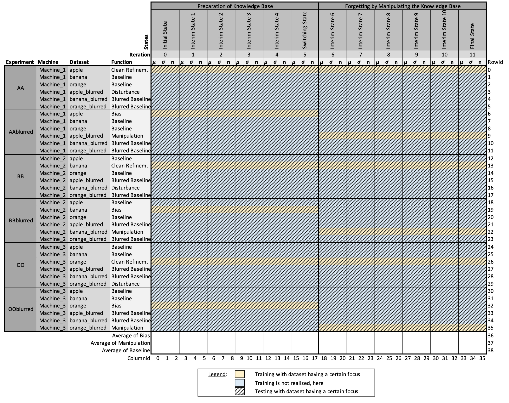
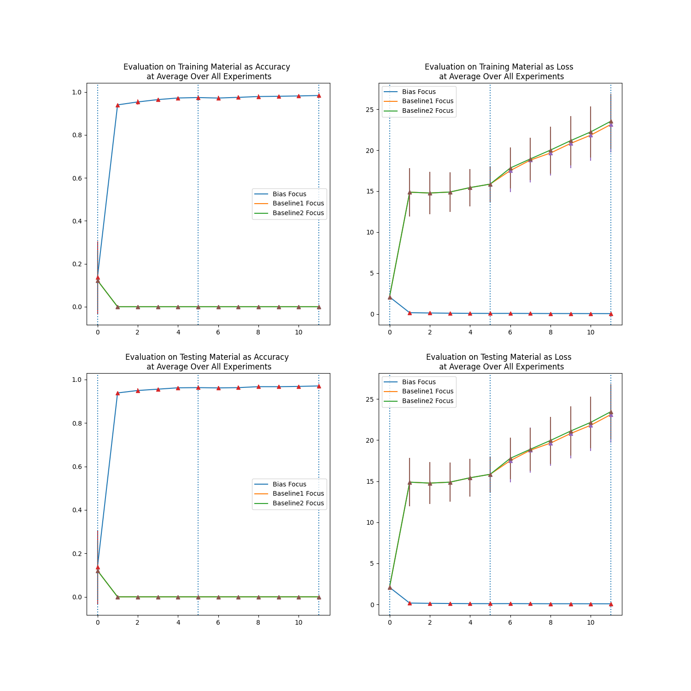

# Experiment 03

The `experiment03` simulates the manipulation of CPS knowledge base by worsening sensors badly affecting tasks: filtering sensory input (in context of continual learning and training data manipulation): 
Inhowfar do AI-based CPS forget if current evaluation task is disturbed by defect sensors, such as providing blurred images that do not correspond to the CPS's current specialization?

## Getting-Started

### ...via message client remotely

1. Start the `message broker`. Further details can be found at the corresponding `Readme.md`.

1. Start the `messaging client` by

    ```
    python3 ../../messageClient/AI_simulation_basis_communication_client.py
    ```

1. Initiate `realize_annExperiment` request, which for instance can come from an Industry 4.0 production system, a modeling software or manually.

    ```
    mosquitto_pub -t "CoNM/workflow_system" -u user1 -P password1 -m "Please realize the following AI case: scenario=realize_annExperiment, knowledge_base=-, activation_base=-, code_base=-, learning_base=-, sender=SenderA, receiver=ReceiverB." -h "localhost" -p 1883
    ```
    
    Please note: Make sure that the corresponding experiment selection
	in the `realize_scenario()` function in `AI_simulation_basis_communication_client.py` is uncommented.
	Alternatively, an individual scenarios can be provided, here,
	so that each experiment can be triggered remotely if requested.

### ...manually

1. Start the script by

    ```
    python3 experiment03.py
    ```

## Experiment characterization

### Knowledge base use in corresponding experiments

At each experiment, new knowledge bases are created (cf. proceeding).
Since knowledge bases shall be comparable over all experiment runs, subsequent experiments reuse knowledge bases that already have been set up in former experiments.
The following presents an overview of all knowledge bases, their initial creation, and their reuse.


### Proceeding for Experiment03


### KPIs in Experiment03

KPIs collected by the experiment can be found as follows:

For training as well as testing, `accuracies`, `losses`, `number of data` (training or testing data) have been collected as individual kpi files.
These have been reorganized and summarized as `mu`, `sigma` and `n` as the following presents.



These files and KPIs are used for statistical analyses, whose code can be found at the following path:

    ```
    repository/documentation/experiment03/statistics
    ```

### Results of Experiment03

Results of this experiment can be found at the following path:

    ```
    repository/documentation/experiment03/
    ```

Here, one can find KPIs collected as well as plots generated.
For instance, the overview plot shows accuracies and losses of training and testing courses.



Here, faced with the comparison of `clean refinement` and `disturbance`, one can see 
that the specialization shows a certain fault tolerance.
Although the disturbed input shows worse performance characteristics (only in terms of `accuracy`, but not in terms of `loss`),
even disturbed input shows acceptable performance.

Faced with the comparions of `bias` with `manipulation`, one can see
that a focus on learning disturbed material will lead to a slightly better performance in this disturbed setting.
But if tends to worsen performance on the biased, clean and original setting.

Statistics will proof this on a significant level.

### Attempts for a research answer of Experiment03

The research question can be answered as follows:
If defect sensors worsen input, the CPS's current specialization will adapt to the worsened setting and the currently required set of skills.
This might be interpreted to forgetting for a certain percentage.
As the CPS as learned to deal with the defect input, performance will rise in defect environment setting, but lower performance in the original, non-defect environment setting.
So, before a forgetting is trained in an expensive way, it is recommended to repair the sensor at a reasonable price.

On the other hand, the corresponding data set manipulation shows as adequate mechanism to forget at a percentage knowledge level:
The one kind of knowledge will be preserved, while fine details of that kind of knowledge will be forgotten.

A publication about this is in progress.