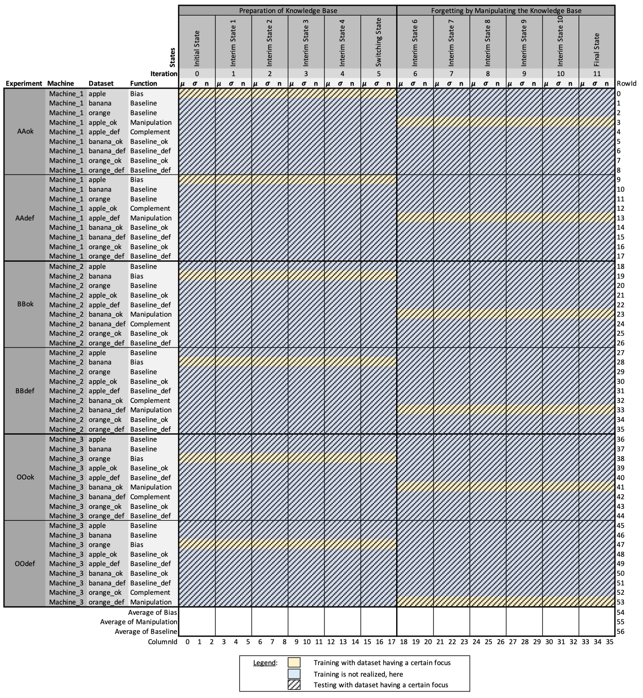
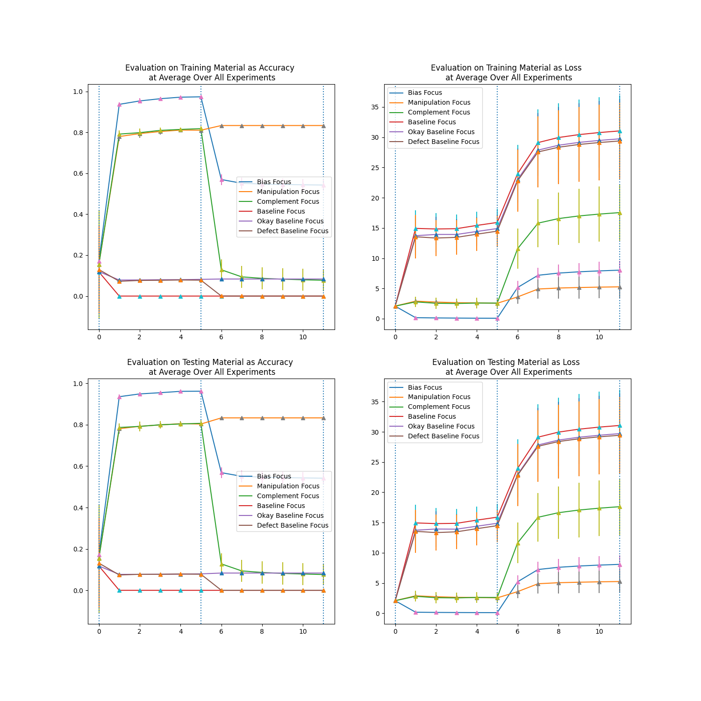

# Experiment 04

The `experiment04` simulates the manipulation of CPS knowledge base by process change - sub-set product change (in context of continual learning and training data manipulation): 
Inhowfar do AI-based CPS forget if a process changes leads to a different product type distribution (in this case a sub-set of trained products) that does not correspond to the CPS's current specialization?

## Getting-Started

### ...via message client remotely

1. Start the `message broker`. Further details can be found at the corresponding `Readme.md`.

1. Start the `messaging client` by

    ```
    python3 ../../messageClient/AI_simulation_basis_communication_client.py
    ```

1. Initiate `realize_annExperiment` request, which for instance can come from an Industry 4.0 production system, a modeling software or manually.

    ```
    mosquitto_pub -t "CoNM/workflow_system" -u user1 -P password1 -m "Please realize the following AI case: scenario=realize_annExperiment, knowledge_base=-, activation_base=-, code_base=-, learning_base=-, sender=SenderA, receiver=ReceiverB." -h "localhost" -p 1883
    ```
	
	Please note: Make sure that the corresponding experiment selection
	in the `realize_scenario()` function in `AI_simulation_basis_communication_client.py` is uncommented.
	Alternatively, an individual scenarios can be provided, here,
	so that each experiment can be triggered remotely if requested.
	
### ...manually

1. Start the script by

    ```
    python3 experiment04.py
    ```

## Experiment characterization

### Knowledge base use in corresponding experiments

At each experiment, new knowledge bases are created (cf. proceeding).
Since knowledge bases shall be comparable over all experiment runs, subsequent experiments reuse knowledge bases that already have been set up in former experiments.
The following presents an overview of all knowledge bases, their initial creation, and their reuse.


### Proceeding for Experiment04


### KPIs in Experiment04

KPIs collected by the experiment can be found as follows:

For training as well as testing, `accuracies`, `losses`, `number of data` (training or testing data) have been collected as individual kpi files.
These have been reorganized and summarized as `mu`, `sigma` and `n` as the following presents.



These files and KPIs are used for statistical analyses, whose code can be found at the following path:

    ```
    repository/documentation/experiment04/statistics
    ```

### Results of Experiment04

Results of this experiment can be found at the following path:

    ```
    repository/documentation/experiment04/
    ```

Here, one can find KPIs collected as well as plots generated.
For instance, the overview plot shows accuracies and losses of training and testing courses.



Here, one can see 
that the `bias` worsens when training focuses on a sub-set of that training material.
Apparently, the complement has been unlearnt efficiently.

The `manipulation` improves slightly due to the refinement on exactly the manipulation material.
The `complement` worsens drastically due to its exclusion in learning procedures. 

Statistics will proof this on a significant level.

### Attempts for a research answer of Experiment04

The research question can be answered as follows:
If if a process changes leads to a different product type distribution (in this case a sub-set of trained products) 
that does not correspond to the CPS's current specialization,
the CPS's current specialization adapts to the currently required set of skills
and preserves once learnt knowledge effectively while irelevant knowledge is forgotten.
Please remark the different performance levels in terms of `accuracy` and `loss`.
It might be better to learn on a new ANN.

On the other hand, the corresponding data set manipulation shows as adequate mechanism to partly forget knowledge:
The one kind of knowledge shall be preserved, while the other kind of knowledge shall be forgotten.

A publication about this is in progress.