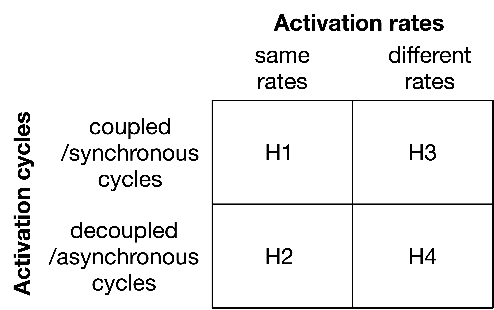

# Experiment 05

The `experiment05` simulates the sequential ANN activation of two cyber-physical systems named `cps1` and `cps2`
while realizing different combinations of `activation rates` and `activation cycles` in 14 experiment variations.
It so focuses on the following research question:
Inhowfar are AI-based CPS disturbed due to different combinations of `activation rates` and `activation cycles`?

Further, it demonstrates the combined AI application of multiple AI libraries, such as TensorFlow and a custom version of PyBrain.

Third, it demonstrates the triggering of timed simulations with a simulation controle and its simulated instances via SimPy.

## Getting-Started

### ...via message client remotely

1. Start the `message broker`. Further details can be found at the corresponding `Readme.md`.

1. Start the `messaging client` at remote system via CLI by

    ```
    python3 repository/code/messageClient/AI_simulation_basis_communication_client.py cps1
    python3 repository/code/messageClient/AI_simulation_basis_communication_client.py cps2
    ```
    
    So, the two systems `cps1` and `cps2` can receive ANN requests and realize them decentrally when triggered.

1. Initiate `realize_annExperiment` request, which for instance can come from an Industry 4.0 production system, a modeling software or manually.

    ```
    mosquitto_pub -t "CoNM/workflow_system" -u user1 -P password1 -m "Please realize the following AI case: scenario=realize_annExperiment, knowledge_base=-, activation_base=-, code_base=-, learning_base=-, sender=SenderA, receiver=ReceiverB." -h "localhost" -p 1883
    ```
	
	Please note: Make sure that the corresponding experiment selection
	in the `realize_scenario()` function in `AI_simulation_basis_communication_client.py` is uncommented.
	Alternatively, an individual scenarios can be provided, here,
	so that each experiment can be triggered remotely if requested.
	
	Further, please note: Make sure that the corresponding experiment variation selection
	in the `realize_scenario()` function in `experiment05.py` is uncommented.
	Alternatively, (a) an individual scenarios can be provided in `AI_simulation_basis_communication_client.py`
	or (b) an individual function or parameter can be used in `experiment05.py`,
	so that each experiment variation can be triggered remotely if requested.
	
1. Simulated systems can be triggered by decentral Human-Machine-Interfaces (HMI), applications or for debugging manually via CLI.
The corresponding commands have been collected for each experiment variation at:
	
	```
	repository/documentation/experiment05/simulation/experimentIdxx/expxx_collectedInstructions.txt
	```

### ...manually

1. Start the script by

    ```
    python3 repository/code/experiments/experiment05.py
    ```
    
    please note: Make sure that the corresponding experiment variation selection
	in the `realize_scenario()` function in `experiment05.py` is uncommented.
	Alternatively, (a) an individual scenarios can be provided in `AI_simulation_basis_communication_client.py`
	or (b) an individual function or parameter can be used in `experiment05.py`,
	so that each experiment variation can be triggered remotely if requested.

1. Simulated systems can be triggered by decentral Human-Machine-Interfaces (HMI), applications or for debugging manually via CLI.
The corresponding commands have been collected for each experiment variation at:
	
	```
	repository/documentation/experiment05/simulation/experimentIdxx/expxx_collectedInstructions.txt
	```

## Experiment characterization

### Knowledge base use in corresponding experiments

At each experiment, new knowledge bases are created (cf. proceeding).
Since knowledge bases shall be comparable over all experiment runs, subsequent experiments reuse knowledge bases that already have been set up in former experiments.
The following presents an overview of all knowledge bases, their initial creation, and their reuse.


### Proceeding for Experiment05

Assuming to have two kinds of cps that do either provide the same or different kinds of `activation rates` 
and synchronous /coupled or asynchronous / decoupled `activation cycles`,
principally, four different kinds of experiment variants need to be examined:



Having a closer look at possible relations of `activation rates` and `activation cycles`,
a more versatile research on 14 experiment variants is enabled:


### Results of Experiment05

Results of this experiment can be found at the following path:

    ```
    repository/documentation/experiment05/simulations
    ```

Here, one can find resulting artifacts of simulated time steps.
For instance, the resulting ANN-based instruction is shown in file `currentApplicationResults.txt`
It clarifies the decodified ANN outcomes and shows the identified fruit, recognized quality and the corresponding transport instruction.

### Attempts for a research answer of Experiment05

The research question can be answered as follows:

The two relevant target dimensions of disruption incidents and inefficiencies were examined in experimental studies and key factors influencing activation rates and activation cycles were identified.
A publication about this is in progress. So please stay tuned for further details and explanations on this, here.

## Publications about Experiment05

Up to its publication, please cite this experiment and the article as follows:

    ```
    Grum, M. (2024). Managing Multi-Site Artificial Neural Networks' Activation Rates and Activation Cycles 
    - Demonstrating the Effects of Activation Types on ANN-based Cyber-Physical Production Systems. 
    In: Technical Report BIS-AI-AS-2024-01, First Edition, January 2024, 
    J.-Chair of Business Information Systems, esp. AI-based Appl. Sys., University of Potsdam, Potsdam, Germany.
    ```
You can find it at

    ```
    repository/documentation/experiment05/publications
    ```